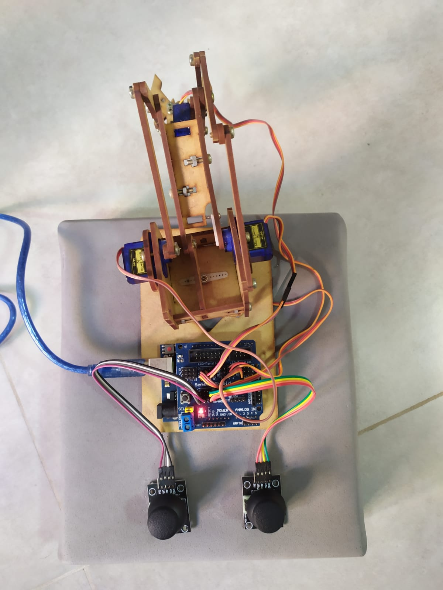
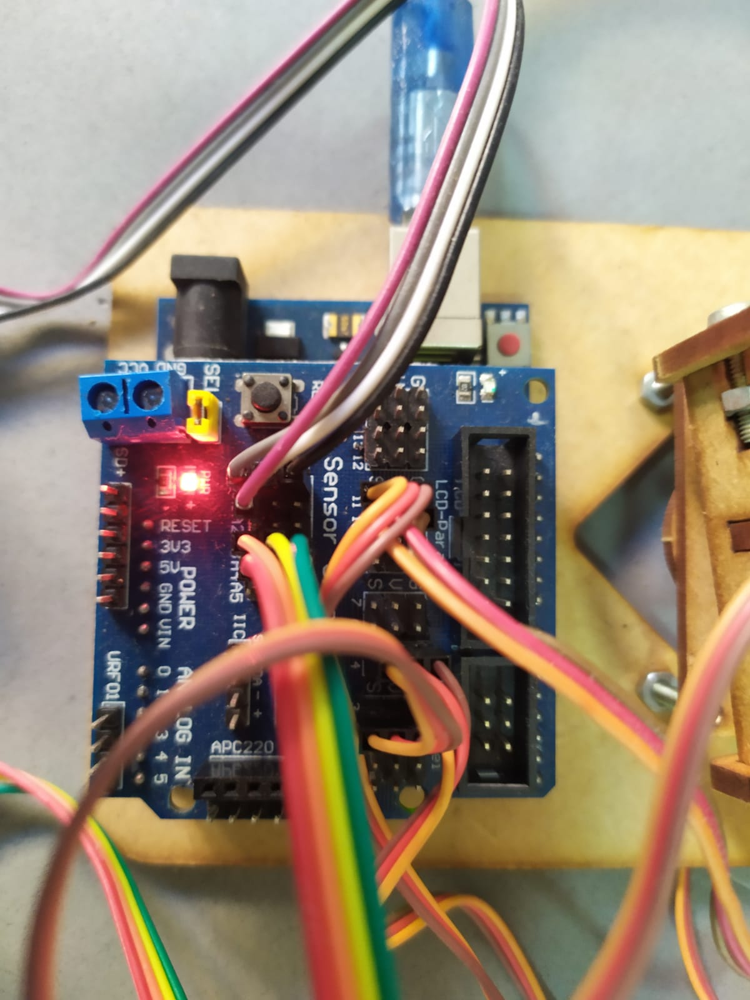
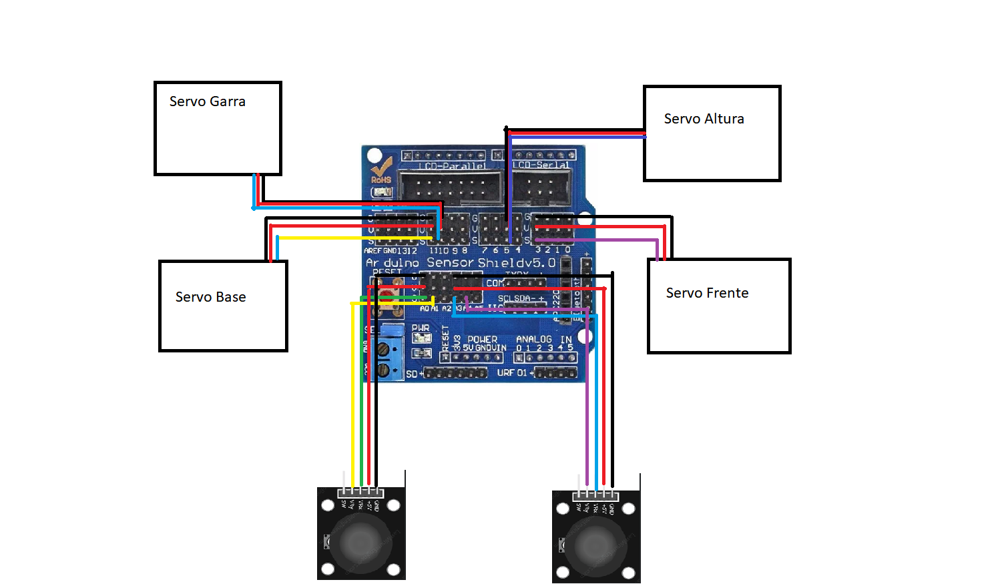

**Projeto Arduino: Braço Robótico**

-----------------------------

**O Braço Robótico implementado utilizando Arduino**

O projeto visa implementar um braço robótico de MDF controlado por dois joysticks.

Componentes do projeto:

 -  1 x Arduino Uno;
 -  1 x Sensor Shield V5.0;
 -  4 x Micro Servos 9g;
 -  2 x Módulos de Analógicos Ky023;
 -  Jumpers;
 -  Braço de MDF;

-----------------------------

**Projeto Montado**

**Conexões no SensorShield V5.0**

O servo "Garra" abre e fecha a garra.
O servo "Frente" altera a profundidade da braço.
O servo "Altura" altera a altura da garra.
O servo "Base" rotaciona a base do braço.

-----------------------------

O código a seguir é responsável por estabelecer a comunicação entre os Joysticks e os Servos que movimentam o braço robótico. Isto é feito por intermédio do Arduino Uno e do SensorShield:

    #include <Servo.h> 
    
    #define LEFT_X A0
    #define LEFT_Y A1
    
    #define RIGHT_X A3
    #define RIGHT_Y A4
    
    #define PIN_ALTURA 5
    #define PIN_FRENTE 3
    #define PIN_GARRA 10
    #define PIN_BASE 11
    
    Servo servo_base, servo_garra, servo_frente, servo_altura; 
    int alx, aly, arx, ary;  
   
    void setup() {
      Serial.begin(9600); 
      alx = 90;
      aly = 90;
      arx = 90;
      ary = 90;
  
      servo_altura.attach(PIN_ALTURA, 1, 180); 
      servo_frente.attach(PIN_FRENTE, 1, 180); 
      servo_garra.attach(PIN_GARRA, 1, 180);
      servo_base.attach(PIN_BASE, 1, 180); 
    }
  
    void move(int *joystick, int *ang, int vel, int drift) {
      if (*joystick > 511+drift && *ang < 180-vel) {
        *ang += vel;
      }
      if (*joystick < 511-drift && *ang > vel) {
        *ang -= vel;
      }
    }

    void loop() {
      int left_x; 
      int left_y; 
      int right_x; 
      int right_y; 
      int drift = 100;
      int vel = 5;
    
      left_x = analogRead(LEFT_X); 
      move(&left_x, &alx, vel, drift);
      servo_altura.write(alx); 
    
      left_y = analogRead(LEFT_Y); 
      move(&left_y, &aly, vel, drift);
      servo_frente.write(aly); 
      
      right_x = analogRead(RIGHT_X); 
      move(&right_x, &arx, vel, drift);
      servo_garra.write(arx); 
      
      right_y = analogRead(RIGHT_Y); 
      move(&right_y, &ary, vel, drift);
      servo_base.write(ary); 
    
      delay(100);
    }

--------------------------------

**Link para o vídeo explicativo do funcionamento do projeto:**

[Vídeo do Projeto](https://youtu.be/kIQm7T29txI)
